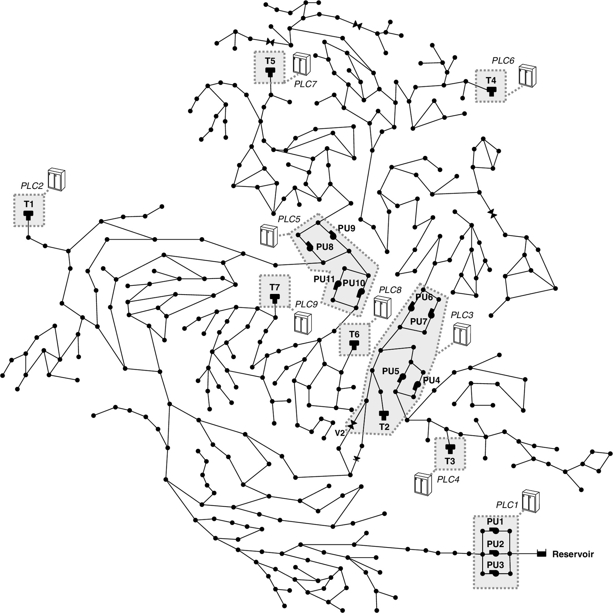

# KAVACH

 Project Overview
​This project focuses on detecting cyber-attacks on Industrial Control Systems (ICS) using the BATADAL (Battle of the Attack Detection Algorithms) dataset. The goal is to identify anomalous behavior in a water distribution system's SCADA data, such as tank overflows or pump manipulations, using Machine Learning.
SCADA data are real-time, field-based network measurements (tank water level, pump flow, etc.) transmitted to the central system by programmable logic controllers (PLCs)

 About the Dataset
​The BATADAL dataset represents a simulated water distribution network. 
C-Town consists of 388 nodes linked with 429 pipes and is divided into 5 district metered areas (DMAs).
More specifically, the SCADA data include the water level at all 7 tanks of the network (T1–T7), status and flow of all 11 pumps (PU1–PU11) and the one actuated valve (V2) of the network, and pressure at 24 pipes of the network that correspond to the inlet and outlet pressure of the pumps and the actuated valve.

Graph Annotation:

L_T #: water level of a tank # [meter].​
S_PU # or S_V # : status of a pump # or a valve # [dmnl]. Binary signal.​
F_PU # or F_V # : flowrate of a pump # or a valve # [L/s].​
P_J # : inlet and outlet pressure for a junction # [meter].
Dataset Details (TL:DR):

There are 43 columns and a 1/0 label column, with 1 meaning that the system is under attack and 0 meaning that the system is in normal operation.
Training Dataset 1: This dataset was released on November 20 2016, and it was generated from a one-year long simulation. The dataset does not contain any attacks, i.e. all the data pertains to C-Town normal operations.
Training Dataset 2: This dataset with partially labeled data was released on November 28 2016. The dataset is around 6 months long and contains several attacks, some of which are approximately labeled.
Test Dataset: This 3-months long dataset contains several attacks but no labels. The dataset was released on February 20 2017, and it is used to compare the performance of the algorithms (see rules document for details).
It consists of:
​Training Dataset 1: 8,761 samples of purely Normal operating data.
​Training Dataset 2: 4,177 samples containing both Normal operations and Attack scenarios (labeled with ATT_FLAG).
​Features: 43 variables including tank levels, inlet/outlet pressures, and pump/valve statuses (On/Off)

The changes and improvements have been documented and are present in repository.